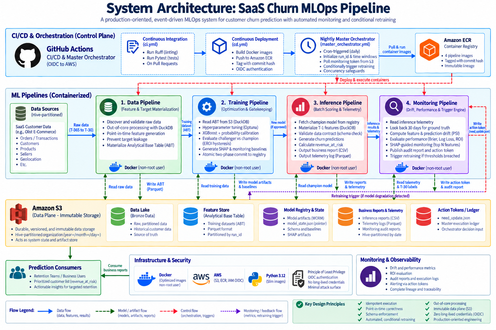

# E-Commerce-Customer-Retention ML System

## Executive Overview & Business Value

Customer retention is structurally more cost-effective than acquisition. This system is an end-to-end, production-oriented Machine Learning engineering platform designed to answer a core business question: *Which existing customers are both valuable to the business and at high risk of churn?*

Rather than being a simple predictive model, this is a decoupled, event-driven **MLOps orchestration system**. It automates daily batch inference, executes defensive statistical monitoring, and dynamically triggers conditional model retraining only when statistically or financially justified. By continuously prioritizing customers based on *Revenue at Risk*, the system ensures that retention teams act on accurate, statistically sound, and financially calibrated signals.

**Note on Simulation Data:** While the system architecture is engineered for subscription-based SaaS telemetry (contractual churn), the publicly demonstrable implementation utilizes the Brazilian Olist E-Commerce dataset as an open-source proxy, modeling customer retention via temporal inactivity windows.

**Engineering Identity:** This system adheres to strict enterprise software engineering principles. It leverages **idempotent** execution boundaries, **out-of-core** data processing to prevent memory bottlenecks, **point-in-time correctness** to eliminate target leakage, and **OIDC-secured**, automated orchestration. It treats ML models not as standalone assets, but as versioned, strictly schema-enforced artifacts governed by a fail-fast CI/CD control plane and an immutable Amazon S3 data plane.

---

## System Architecture



---

## Phase 1: Data Pipeline (Feature & Target Materialization)

**Responsibility:** Transforms raw, Hive-partitioned Bronze data into a validated, point-in-time accurate Analytical Base Table (ABT) for model training, strictly preventing target leakage.

**Engineering Highlights:**

* **Direct S3-to-S3 Streaming:** Utilizes DuckDB with the `httpfs` extension to read raw data, execute memory-efficient out-of-core joins, and `COPY` the compressed Parquet artifact directly to the Feature Store. This entirely bypasses local container disk I/O bottlenecks.
* **Point-in-Time Correctness:** The `SharedFeatureGenerator` enforces strict temporal bounding via SQL, explicitly masking future delivery timestamps and status updates relative to the pipeline's execution `end_date` to mathematically guarantee zero target leakage.
* **Strongly Typed Configuration:** Execution parameters, compute limits (e.g., 4 threads, 8GB memory cap), and business logic (e.g., 180-day churn window) are injected via parsed, immutable YAML dataclasses.

**Execution Flow:**

1. **Fail-Fast Data Discovery:** Translates the requested temporal window into expected S3 Hive partitions (`year=YYYY/month=MM`) and executes highly efficient `MaxKeys=1` Boto3 queries. Fails immediately if upstream partitions are missing, saving compute resources.
2. **Out-of-Core Validation:** Runs structural schema, record count, and critical non-null checks directly against the S3 data lake before feature engineering begins.
3. **Feature Materialization:** Aggregates behavioral, RFM (Recency, Frequency, Monetary), and operational features, joining them with forward-looking target variables (Churn and 180-day LTV).
4. **Metadata Registry:** Extracts deterministic telemetry (row counts, schema MD5 hashes) directly from the finalized Parquet file via S3, publishing a standardized JSON contract for downstream pipelines.

---

## Phase 2: Training Pipeline (Optimization & Gatekeeping)

**Responsibility:** Executes hyperparameter tuning, calibrates probabilities, evaluates the Challenger against the active Champion based on financial ROI, and executes an atomic deployment to the Model Registry.

**Engineering Highlights:**

* **Strict Training-Serving Parity:** Implements a custom Scikit-Learn `CategoricalSchemaEnforcer` that learns exact dataset schemas and rigidly enforces Pandas categorical dtypes to prevent unseen-category exceptions during inference.
* **Probability Calibration:** Wraps the base XGBoost estimator in a `CalibratedClassifierCV` (Isotonic regression). This guarantees that output scores are true real-world probabilities, which is mathematically required for accurate downstream financial calculations.
* **Scikit-Learn Mega-Pipeline:** Bundles the stateful schema enforcer and the calibrated model into a single serialized `model.pkl` artifact, ensuring data transformations and inference logic are strictly coupled.
* **Atomic Two-Phase Commit:** Deploys models using a zero-downtime, rollback-ready S3 architecture. Artifacts are written to an immutable WORM (Write-Once-Read-Many) vault, followed by an atomic overwrite of a global `model_state.json` routing pointer.

**Execution Flow:**

1. **Out-of-Core Processing:** Utilizes DuckDB to stream the massive Master Panel dataset directly from S3, performing a memory-efficient random split (Train/Val/Test) and writing fragments to local disk to prevent OOM errors.
2. **Hyperparameter Optimization:** Executes a Bayesian search via Optuna (`TPESampler`) with strict early stopping to discover the optimal XGBoost configuration within the defined search space.
3. **Explainability & Telemetry:** Generates global SHAP feature importance artifacts (from the uncalibrated base model) and extracts reference feature statistical distributions for downstream Data Drift monitoring.
4. **The Hysteresis Duel (Business Gatekeeper):** Evaluates the new Challenger model against the holdout Test set by executing a threshold sweep to maximize Expected ROI (EROI). Fetches the active Champion model from S3 and compares them. The Challenger is only deployed if its EROI beats the Champion by a strictly defined configuration margin (`eroi_hysteresis_margin`), preventing trivial model churn.

---

## Phase 3: Inference Pipeline (Batch Scoring & Telemetry)

**Responsibility:** Executes daily batch scoring on the active customer base, applies fail-fast data contract validation, and generates both a financially-prioritized business report and a Hive-partitioned MLOps telemetry log.

**Engineering Highlights:**

* **Zero Training-Serving Skew:** Reuses the exact same `SharedFeatureGenerator` utility from the Training Pipeline. Features are materialized out-of-core via DuckDB, mathematically guaranteeing that SQL inference logic perfectly matches Python training logic.
* **Fail-Fast Data Contracts:** Implements a strict `InferenceValidator` Gatekeeper. Before any scoring occurs, the pipeline dynamically compares the newly materialized feature matrix schema against the serialized JSON blueprint of the Champion model. If required predictive features or entity mappings are missing, the pipeline halts gracefully to prevent silent failures.
* **Financial Risk Prioritization:** Beyond outputting raw probabilities, the pipeline dynamically calculates `revenue_at_risk` (Churn Probability × Customer LTV/Monetary Value), sorting the final output so retention teams focus on the highest financial impact first.
* **Master Inference Ledger:** Consolidates stage-level operational metadata (execution times, row counts, artifact sizes, data provenance) into a unified JSON ledger published alongside every run for complete auditability.

**Execution Flow:**

1. **Model Loader:** Securely fetches the global `model_state.json` pointer from the S3 registry, dynamically resolving and downloading the active Champion model, its schema contract, and monitoring baselines.
2. **Feature Matrix Builder:** Executes an out-of-core DuckDB SQL query to materialize the T-1 temporal feature snapshot directly to local Parquet.
3. **Data Contract Gatekeeper:** Validates entity integrity and predictive feature completeness between the new Parquet file and the expected model schema.
4. **Report Generator:** Drops system columns, executes batch inference, and forks the output into two streams: a stakeholder-facing Business Report (CSV) and an MLOps-facing Telemetry Log (Parquet).
5. **Report Publisher:** Constructs standard Hive-partitioned S3 URIs (`year=YYYY/month=MM/day=DD`) and executes an idempotent upload of the reports and the Master Inference Ledger to the Cloud Data Lake.

---

## Phase 4: Monitoring Pipeline (Drift, Performance & Trigger Engine)

**Responsibility:** Deterministically evaluates model health using both label-independent (drift) and label-dependent (performance) metrics. If performance decays beyond acceptable financial or statistical thresholds, it publishes a decision token to trigger automated retraining.

**Engineering Highlights:**

* **Defensive System Maturity Handling:** The pipeline anticipates real-world production edges. If the system is immature (e.g., within the initial 30-day lookback window) or experiences zero-traffic days, it gracefully generates 0-row schema footprints and bypasses metrics calculation to prevent pipeline crashes.
* **Anti-Alarm Fatigue (SHAP-Guided Monitoring):** Rather than monitoring all features and triggering false positive alerts, the engine dynamically extracts the Top $N$ most important features from the Champion model's SHAP baseline, restricting covariate shift detection strictly to variables that influence predictions.
* **Mathematically Robust PSI:** The Population Stability Index (PSI) logic is physical-type aware. It enforces strict bin-edge and category continuity from the training reference and applies epsilon-clipping to algorithmically mitigate the Zero-Bin problem (preventing `log(0)` and divide-by-zero exceptions).
* **Financial Calibration:** Calculates Realized ROI on the matured lookback cohort by simulating intervention costs against True/False Positives, translating statistical degradation directly into business impact.

**Execution Flow:**

1. **Baseline & Telemetry Resolver:** Uses DuckDB to fetch today's proactive inference telemetry. Simultaneously, it looks back 30 days, re-invokes the `SharedFeatureGenerator`, and executes an out-of-core join against the Data Lake to construct a matured evaluation cohort with actual ground-truth labels.
2. **Statistical Drift Calculator:** Computes type-aware PSI for the target prediction distribution and the Top $N$ SHAP-ranked features against the Champion model's frozen baselines.
3. **Performance Evaluator:** Computes strictly proper scoring rules (Brier Score, Log Loss with epsilon clipping) and Realized ROI on the matured T-30 cohort.
4. **Deterministic Rule Engine:** Evaluates thresholds to output an immutable boolean `need_update` payload based on three conditions: Critical Prediction Drift, Critical Feature Drift, or Severe Performance Degradation (relative Brier Score decay).
5. **Artifact Publisher:** Uploads the comprehensive Audit Report, the Action Token (`need_update.json`), and a unified Master Execution Ledger to Hive-partitioned S3 directories, providing a clean state contract for the Master Orchestrator.

---

## Infrastructure & Security: Containerization Strategy

The system utilizes highly optimized, pipeline-specific Docker images built on `python:3.12.1-slim-bookworm`. Rather than deploying a monolithic environment, each of the four pipelines is containerized independently to minimize image bloat, strict-scope dependencies, and restrict lateral security access.

**Engineering Highlights:**

* **Zero-Bloat Multi-Stage Builds:** Employs a two-stage build process. C-linked Python dependencies are compiled in a fat `builder` stage, but only the isolated virtual environment (`/opt/venv`) is migrated to the `runtime` stage. This entirely removes compilers (`build-essential`) from the final production images, drastically reducing the CVE attack surface.
* **Principle of Least Privilege (PoLP):** Containers execute under a dedicated, non-root `pipelineuser` initialized with a disabled login shell (`/sbin/nologin`). Privileges are strictly downgraded via the `USER` directive prior to execution, passing standard enterprise InfoSec compliance checks.
* **Hardware & Framework Awareness:** System-level dependencies are tailored per pipeline. The Training and Inference images explicitly inject `libgomp1` to enable OpenMP multi-core parallelization for XGBoost and Scikit-Learn, while AWS TLS certificates (`ca-certificates`) are scoped only where S3 communication is required.
* **Out-of-Core Memory Safety:** The Data Pipeline container explicitly provisions and permissions a `/tmp/data_pipeline_spill` directory for the non-root user. This mathematically prevents fatal "Permission Denied" OS errors when DuckDB exceeds container RAM limits and forces disk-spilling during massive joins.
* **Targeted Build Contexts:** Explicitly avoids `COPY . .` anti-patterns. Images selectively mount only the `shared_core/` utility module and their specific pipeline source code. This enforces strict architectural boundaries, optimizes Docker layer caching, and prevents testing data or cross-pipeline logic from polluting the runtime.

---

## CI/CD & Master Orchestration

The system employs strict MLOps automation, utilizing GitHub Actions as a control plane while Amazon S3 acts as the data plane. The architecture entirely decouples container execution from state management, enabling high reliability and clean lineage.

### Continuous Integration (CI)

* **Quality Gates:** Triggers on Pull Requests to `main`. Executes `Ruff` for strict linting and style enforcement, followed by a `Pytest` suite for unit and integration testing.
* **Optimized Feedback:** Utilizes `if: always()` step conditions to guarantee test suite execution even if linting fails, providing developers with comprehensive feedback in a single run. Caches `pip` dependencies to minimize compute time.

### Continuous Deployment (CD)

* **Zero-Secret OIDC Auth:** Authenticates to AWS via OpenID Connect (OIDC), entirely eliminating long-lived, static IAM credentials from the repository environment.
* **Immutable Lineage:** Builds and pushes the four distinct pipeline images to Amazon ECR, tagging them strictly with the Git commit hash (`${{ github.sha }}`). This guarantees that every model prediction in production can be traced back to the exact code state that generated it.

### Nightly Master Orchestrator (MLOps DAG)

* **Temporal Context Injection:** A cron-triggered DAG initializes a globally unique `run_id` and calculates exact temporal boundaries (e.g., T-365 to T-30 lookback windows). These are injected into ephemeral Docker containers as environment variables, guaranteeing idempotency across the entire execution graph.
* **Concurrency Safeguards:** Enforces strict pipeline concurrency (`cancel-in-progress: false`). If a previous nightly run (or manual trigger) is still executing, the orchestrator blocks overlapping runs to mathematically prevent Data Lake corruption.
* **Decoupled Decision Gate:** Rather than directly linking the Monitoring and Data pipelines, the orchestrator acts as a decoupled event router. It polls S3 for a highly specific, Hive-partitioned Action Token (`need_update_<run_id>.json`).
* **Fail-Fast Parsing:** The orchestrator utilizes defensive Bash (`aws s3 ls` paired with `jq`) to validate token existence before parsing. If model health has degraded (`need_update == true`), the workflow dynamically branches to execute the out-of-core Data Pipeline and subsequent Training Pipeline to deploy a new Champion model.

---

## Reproducing the System (Local Validation & Cloud Deployment)

### 1. Local Environment Setup

Initialize an isolated execution environment and pull the project source code:

```bash
# Clone the repository
git clone https://github.com/thesahilmandal/E-Commerce-Customer-Retention-Pipeline.git

# Extract all files from the 'Project01' folder to the current directory and delete it
mv Project01/* Project01/.[!.]* . 2>/dev/null || true
rm -rf Project01

# Initialize isolated Python 3.12 environment
python3.12 -m venv venv
source venv/bin/activate

# Install pipeline dependencies
pip install --upgrade pip
pip install -r requirements.txt
```

### 2. AWS Prerequisites & Configuration

1. Authenticate your local AWS CLI environment:

```bash
aws configure
```

2. Provision two S3 buckets in your AWS account and map their **names** (not URIs) in a local `.env` file at the repository root:

```env
S3_CUSTOMER_DATABASE="<YOUR_CUSTOMER_DATABASE_BUCKET_NAME>"
S3_PIPELINE_RUN_ARTIFACTS="<YOUR_ARTIFACTS_BUCKET_NAME>"
```

3. Load the environment variables into your current shell session:

```bash
set -a && source .env && set +a
```

### 3. Bootstrapping the Data Lake (Simulated Production Data)

Populate the S3 Data Lake with the historical e-commerce dataset required for processing.

```bash
# 1. Ingest raw Brazilian E-Commerce dataset into the artifacts bucket
python -m tools.raw_data_loader

# 2. Transform into Hive-partitioned format and migrate to the Customer Database bucket
python -m tools.hive_partitioned_generator
```

### 4. Local Pipeline Execution (End-to-End Test)

Execute the core pipelines sequentially via their module runners to simulate the complete MLOps lifecycle.

*Note: You can inspect the auto-generated `logs/` directory during and after execution to view the operational telemetry emitted by each pipeline component.*

```bash
# 1. Data Pipeline: Materialize the T-365 to T-30 feature matrix
python -m pipelines.data_pipeline.src.runner \
  --run-id="testing_01" \
  --start-date="2016-09-01" \
  --end-date="2018-03-01"

# 2. Training Pipeline: Optimize, calibrate, and register the Champion model
# Replace the bucket placeholder below with your actual artifacts bucket name.
python -m pipelines.training_pipeline.src.runner \
  --run-id="testing_01" \
  --dataset-uri="s3://<YOUR_ARTIFACTS_BUCKET_NAME>/feature_store/testing_01/dataset.parquet"

# 3. Inference Simulation: Generate synthetic 'yesterday' customer data footprints
python -m tools.synthetic_data_generator

# 4. Inference Pipeline: Score the active customer base
python -m pipelines.inference_pipeline.src.runner \
  --run-id="testing_01"

# 5. Monitoring Pipeline: Evaluate statistical drift and ROI degradation
python -m pipelines.monitoring_pipeline.src.runner \
  --run-id="testing_01" \
  --execution-date="$(date +%Y-%m-%d)"
```

### 5. Cloud Deployment via GitHub Actions

To orchestrate the system autonomously in the cloud via the provided CI/CD and MLOps DAG:

1. **AWS Infrastructure:** Create an OIDC Identity Provider in AWS IAM connected to your GitHub repository. Provision four Amazon ECR repositories to host the pipeline images.
2. **GitHub Repository Variables:** Configure the following repository variables (not secrets) in your GitHub repository settings:

* `AWS_REGION`
* `AWS_ROLE_ARN` *(The IAM role assumable via OIDC)*
* `ECR_DATA_PIPELINE` *(Name of the Data ECR repository, not the URI)*
* `ECR_TRAINING_PIPELINE` *(Name of the Training ECR repository, not the URI)*
* `ECR_INFERENCE_PIPELINE` *(Name of the Inference ECR repository, not the URI)*
* `ECR_MONITORING_PIPELINE` *(Name of the Monitoring ECR repository, not the URI)*
* `S3_PIPELINE_RUN_ARTIFACTS` *(Name of the Artifacts S3 bucket, not the URI)*
* `S3_CUSTOMER_DATABASE` *(Name of the Database S3 bucket, not the URI)*

3. **Workflow Execution:** Push changes to the `main` branch. Navigate to the GitHub Actions tab. You must manually trigger the deployment workflows in this strict order for the initial run:

* **First:** Run **Continuous Deployment** (`cd.yml`) to build and push all Docker images to ECR.
* **Second:** Run **Master Orchestrator** (`master_orchestrator.yml`) to execute the nightly batch DAG.

---

## Repository Structure

```text
.
├── .github/
│   └── workflows/
│       ├── ci.yml                        # Code quality & testing
│       ├── cd.yml                        # Build & push to ECR
│       └── master_orchestrator.yml       # Production ML orchestration DAG
├── docs/
│   └── images/
│       └── system-architecture.png       # System architecture diagram
├── pipelines/
│   ├── data_pipeline/
│   │   ├── configs/                      # YAML definition files
│   │   ├── src/                          # Discovery, validation, materialization
│   │   ├── tests/
│   │   └── Dockerfile                    # Multi-stage definition
│   ├── training_pipeline/
│   │   ├── configs/
│   │   ├── src/                          # Model tuning, evaluation, WORM registry
│   │   ├── tests/
│   │   └── Dockerfile
│   ├── inference_pipeline/
│   │   ├── configs/
│   │   ├── src/                          # Matrix builder, contract validation, scoring
│   │   ├── tests/
│   │   └── Dockerfile
│   └── monitoring_pipeline/
│       ├── configs/
│       ├── src/                          # Drift, performance, and rule engine
│       ├── tests/
│       └── Dockerfile
├── shared_core/
│   ├── cloud/                            # Idempotent S3 operations
│   ├── exceptions/                       # Centralized error handling
│   ├── features/                         # Shared temporal SQL logic
│   ├── logging/                          # Standardized JSON log formatting
│   └── utils/
├── tools/                                # Synthetic data generation & loaders
├── .gitignore
├── requirements.txt
└── README.md
```
